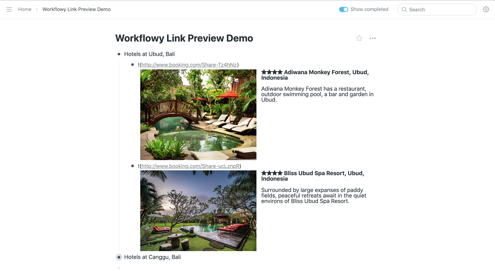
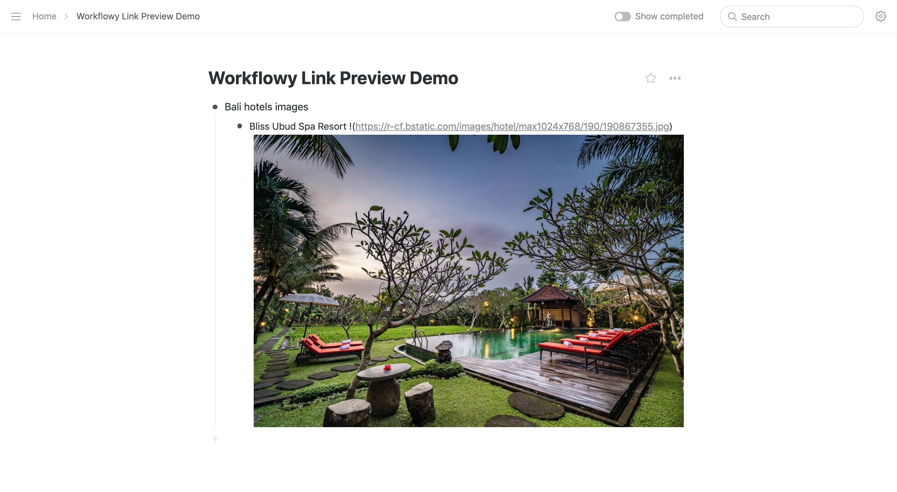

# WorkFlowy Link Preview

Links previewer extension for https://workflowy.com/

## About

This Google Chrome browser extension allows users to preview any URL inside a WorkFlowy bullet node.

The extension fetches provided URL meta tags data (image, title and description) in the background process and embeds it to the WorkFlowy bullet node.

Alongside with URL preview, this extension allows users to preview images and gifs.

## Usage

Preview any URL using the following syntax:

`!(your URL goes here inside the round brackets)`

For example:

`!(https://www.booking.com/Share-Tz4hNz)`

or image link:

`!(https://r-cf.bstatic.com/images/hotel/max1024x768/190/190867355.jpg)`

## Installation

1. Add [Chrome extension](https://chrome.google.com/webstore/detail/workflowy-link-preview/fljjakgbhacdbaakanomobomelbkjafm) to your browser.
2. Refresh https://workflowy.com/ web page.

## Motivation

First of all, I'm in love with WorkFlowy. It's such powerful and yet simple tool that helps me to organize my whole life.

Pretty often, I found myself missing such preview feature when I'm deciding where to stay during my trip (I like to create a list of hotels and with Link Previewer it's much easier for me to understand what is what).
One more recent case, I was about buying a new camera, so I made a list of cameras I was intended to buy and with Link Previewer it was much simpler to decide which one to choose.

Last, but not least, I always was curious about building a browser extension, hence I got a lot of joy during development.

## Support

If you have discovered a bug or have a feature suggestion, feel free to create an issue on Github.

Also, you can drop me a message on my twitter - [@roman_chukhan](https://twitter.com/roman_chukhan).

## Acknowledgements

WorkFlowy Link Preview project was inspired by [Frank Degenaar](https://twitter.com/ProMashUp) - ["Get Workflowy Inline Images out of your System in 2016"](https://blog.workflowy.com/2016/01/06/inline-images/) and [Jonathan Leung](https://github.com/jonleung) - [Workflowy Images](http://jonl.org/hexo-blog/workflowy-images/).

WorkFlowy Link Preview icon made by [Freepik](https://www.flaticon.com/authors/freepik) from www.flaticon.com.

## License

[MIT](LICENSE)
